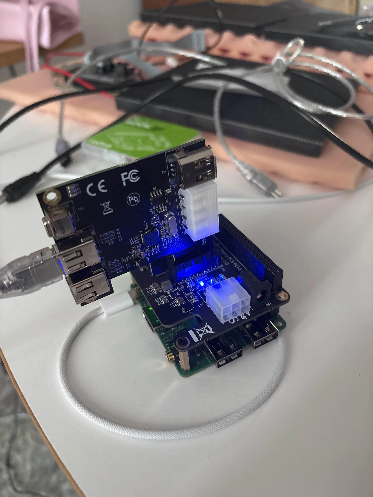
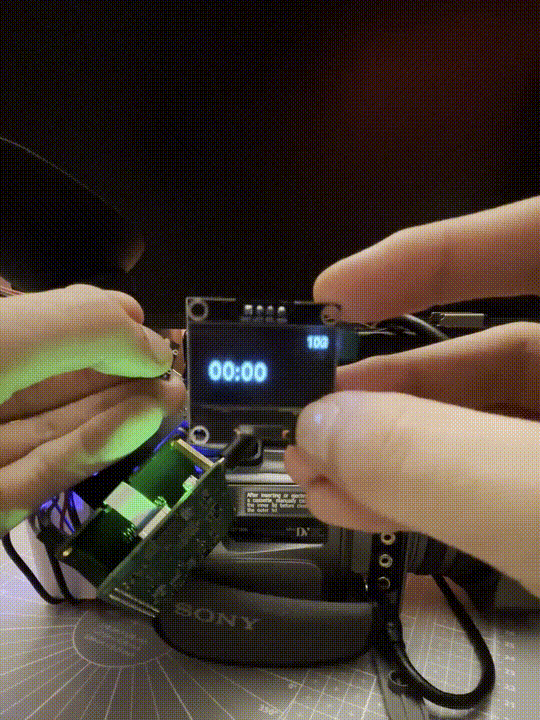

## equip-1 0.1 alpha

Hardware:

- Radxa 2f 2Gb RAM 8Gb eMMC (Raspberry Pi needs testing)
- [Rasperry Pi 5 PCIe Hat](https://de.aliexpress.com/item/1005007875203834.html) (Compatible with the 2f)
- [VIA VT6315N Firewire card](https://de.aliexpress.com/item/1005005044278296.html)
- A good firewire cable (Sometimes there are these transparent cables delivered with the firewire card, they did not work for me!)

Software:

- [Rock 2f Custom Firewire Armbian Image](https://drive.google.com/drive/folders/1kLxVSK0Dhzc2q1MnAXW4JjSZa23EkOea?usp=sharing)
- [DVGrab](https://github.com/ddennedy/dvgrab)

### Install custom OS

[Use this guide](https://docs.radxa.com/en/rock2/rock2f/getting-started/install-os/maskrom) to install the provided image on the 2f.
The provided image has the custom firewire kernels already installed, created by the [armbian-build tool](https://github.com/armbian/build). The folder also contains the SPI loader file, which is needed for flashing the OS on the 2f. Disconnect the 2f after you finished the installation.

### Connect the hardware and first boot

Attach the hat on the 2f, connect the ffc cable, and slide the firewire card in the PCIe connector.

Connect the 2f to a screen and keyboard and then boot it. Go through the setup.

Use `lspci` to check if the firewire card got recognized.

### DVGrab and recording

If the firewire card shows up, it is now time to install DVGrab.

```
sudo apt install dvgrab
```

Connect your camera to the setup and turn it on (Camera mode).

Enter this command to start capturing:

```
dvgrab -buffers 20 name-
```

You are now capturing DV footage via firewire on a self build device!

To end the recording press `ctrl + c` and the .dv file will be saved in the destination, where you started the command from.



### Making it portable

Adding a NEEWER 10500mAh NP-F970 battery can power this setup via the usb-c port.


To control the device, a small button and an OLED screen are added using the GPIO pins of the 2F.



If you like this project and want to know more about the development and future steps, or even build your own version, feel free to [join this discord](https://discord.gg/KU3UhgPA7P). We are a tiny community building objects with computers!
