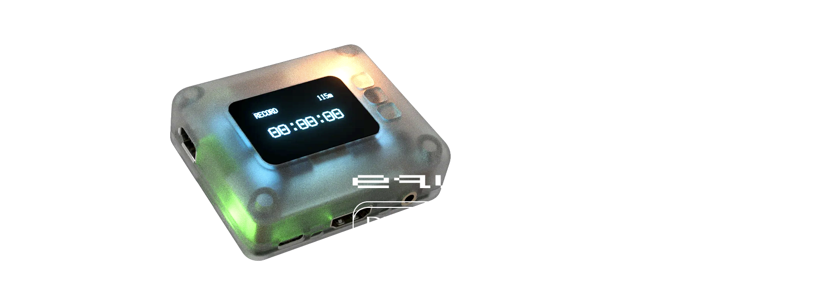

# Equip-1: DV RECORDER

Equip-1 is an open-source, portable DV/HDV recorder for camcorders with FireWire/i.LINK/DV output. It is built around a Radxa ROCK 2F and a custom PCIe FireWire HAT, so you can mount it near a camera, power it from USB-C, press one button, and record tape footage directly to removable storage.

The project is for camera enthusiasts, videographers, film schools, archivists, and hardware/software contributors who want a modern, repairable path for capturing DV tapes without keeping an old laptop alive.

The [Firehat](https://github.com/computerequipmentgroup/firehat) is also available standalone. It works as a HAT for the ROCK 2F, Raspberry Pi 5, and other SBCs.

Website: <https://www.equip-1.c-e.group/>  
Community Discord: [discord.gg/wpXmcb5mvK](https://discord.gg/wpXmcb5mvK)

## Getting started

### 1. Get or build an image

Equip-1 is Buildroot-first. The image contains the recorder daemon, OLED/buttons UI, static web dashboard, Wi-Fi AP, storage handling, and HDMI preview service.

Prebuilt images are attached to GitHub releases:

<https://github.com/computerequipmentgroup/equip-1/releases>

Download the image for your hardware, decompress it if needed, and flash it to a microSD card. To build from source instead:

```bash
./src/buildroot/scripts/build.sh
./src/buildroot/scripts/flash.sh
```

The default runtime settings are baked into the image from:

```text
src/buildroot/overlay/etc/equip1/equip-1.ini
```

On a running device, edit the live settings file at:

```text
/etc/equip1/equip-1.ini
```

### 2. Connect to Equip-1

Default device access:

| Setting | Default |
| --- | --- |
| Wi-Fi SSID | `Equip-1` |
| Wi-Fi password | `firesecret` |
| Dashboard | `http://10.42.0.1:8000` |
| API base | `http://10.42.0.1:8000/api` |

Connect a phone or laptop to the Equip-1 Wi-Fi network, open the dashboard, attach a FireWire DV/HDV camera, and use the web UI or the device buttons to preview and record.

### 3. Prepare capture storage

Equip-1 records to `/data/captures` by default. At boot it prefers a non-root exFAT USB-A drive labelled `EQUIP1`; otherwise it falls back to the SD-card data partition when available.

Recommended USB storage format:

- filesystem: exFAT
- label: `EQUIP1`
- mount point on device: `/data`
- captures path: `/data/captures`

### 4. Record and export

Completed recordings are written as original `.dv` captures. By default, Equip-1 also creates same-stem `.mp4` sidecars in the background.

MP4 quality presets:

| Setting | OLED label | Use |
| --- | --- | --- |
| `small` | `[28]` | Smallest files |
| `balanced` | `[23]` | Middle ground |
| `high` | `[18]` | Default, close to source for most DV material |
| `max` | `[14]` | Highest quality, larger and slower |

See [`src/docs/mp4-export.md`](src/docs/mp4-export.md) for the full export flow.

## `/etc/equip1/equip-1.ini` options

Environment variables with matching `EQUIP1_*` names override INI values, which is useful for local development and one-off device debugging. The OLED/web settings UI may also persist some values back into this file.

Example:

```ini
[network]
ap_ssid = Equip-1
ap_password = firesecret

[recording]
capture_dir = /data/captures
storage_label = EQUIP1
auto_convert_mp4 = true
mp4_quality = high
mp4_deinterlace = true
auto_storage_switch = true

[hdmi]
enabled = true

[logging]
log_level = info
```

### `[recording]`

| Key | Default | Purpose |
| --- | --- | --- |
| `capture_dir` | `/data/captures` | Directory for `.dv` recordings and `.mp4` sidecars |
| `storage_label` | `EQUIP1` | Preferred USB-A exFAT volume label |
| `data_mount` | `/data` | Mount point used by the boot storage script |
| `data_mount_options` | `noatime` | exFAT mount options |
| `data_mount_timeout` | `15` | Seconds before a mount attempt is timed out |
| `usb_data_wait_seconds` | `0` | Seconds to wait at boot for USB storage to appear |
| `data_boot_diagnostics` | `0` | Emit extra USB/storage boot diagnostics |
| `normalize_dif_headers` | `1` | Normalize DV DIF headers while recording |
| `auto_storage_switch` | `true` | Switch between USB and SD storage automatically while idle |
| `auto_storage_cooldown_seconds` | `5` | Minimum seconds between automatic storage switch attempts |
| `capture_prefix` | `capture_` | Filename prefix for new captures |
| `filename_template` | `{date}_{time}` | Filename template; common tags include `{date}`, `{time}`, `{datetime}` |
| `auto_convert_mp4` | `true` | Create `.mp4` sidecars after recording |
| `mp4_quality` | `high` | `small`, `balanced`, `high`, or `max` |
| `mp4_deinterlace` | `true` | Apply FFmpeg `yadif` deinterlacing during MP4 export |

### `[network]`

| Key | Default | Purpose |
| --- | --- | --- |
| `wifi_mode` | `ap` | `ap`, `client`, or `off` |
| `host` | `0.0.0.0` | Daemon bind host |
| `port` | `8000` | Dashboard/API port |
| `ap_enabled` | `1` | Include AP details in daemon state |
| `ap_iface` | `wlan0` | Wi-Fi interface |
| `ap_ssid` | `Equip-1` | Access-point SSID |
| `ap_password` | `firesecret` | WPA2 password; must be 8-63 characters |
| `ap_ip` | `10.42.0.1` | Access-point IP address |
| `ap_cidr` | `24` | Access-point subnet prefix length |
| `ap_channel` | `6` | Wi-Fi AP channel |
| `ap_dhcp_start` | `10.42.0.10` | DHCP range start |
| `ap_dhcp_end` | `10.42.0.100` | DHCP range end |
| `ap_dhcp_lease` | `12h` | DHCP lease duration |
| `ap_country` | empty | Optional regulatory country code |
| `startup_background` | `1` | Continue boot while Wi-Fi starts |
| `captive_enabled` | `true` | Enable captive redirect in AP mode |
| `captive_host` | `0.0.0.0` | Captive redirect bind host |
| `captive_port` | `80` | Captive redirect port |
| `captive_dashboard_url` | derived | Optional explicit captive redirect target |

For `wifi_mode = client`, configure `/etc/wpa_supplicant.conf` in the image/device.

### `[preview]`

| Key | Default | Purpose |
| --- | --- | --- |
| `fps` | `25` | Browser MJPEG preview FPS while idle |
| `size` | `720:540` | Browser MJPEG preview size while idle |
| `quality` | `4` | MJPEG quality while idle |
| `recording_fps` | `2` | Lower preview FPS while recording |
| `recording_size` | `480:360` | Lower preview size while recording |
| `recording_quality` | `5` | MJPEG quality while recording |
| `filter` | generated | Full custom idle FFmpeg video filter |
| `recording_filter` | generated | Full custom recording FFmpeg video filter |

### `[hdmi]`

| Key | Default | Purpose |
| --- | --- | --- |
| `enabled` | `true` | Start the HDMI framebuffer preview watcher |
| `stream_url` | `http://127.0.0.1:8000/api/stream.mkv?takeover=1` | MKV stream consumed by HDMI preview |
| `fbdev` | `/dev/fb0` | Framebuffer device |
| `poll_seconds` | `1` | HDMI status polling interval |
| `assume_connected_without_drm` | `0` | Treat HDMI as connected when DRM status is unavailable |
| `pix_fmt` | empty | Optional framebuffer pixel-format override |
| `ffmpeg_loglevel` | `info` | FFmpeg log level for HDMI preview |
| `ffmpeg_progress` | `0` | Enable FFmpeg progress output |
| `ffmpeg_stats_period` | `5` | FFmpeg stats interval |
| `clear_on_connect` | `1` | Clear framebuffer when HDMI connects |

### `[ui]`

| Key | Default | Purpose |
| --- | --- | --- |
| `board_type` | `rock2f` | OLED/buttons hardware profile |
| `api_base` | `http://127.0.0.1:8000/api` | OLED API base URL |
| `api_timeout` | `5.0` | OLED HTTP timeout |
| `state_fetch_interval` | `1.0` | OLED state polling interval |
| `oled_fps` | `8` | OLED render-loop FPS |
| `boot_duration_seconds` | `3.0` | Boot animation duration |
| `boot_hold_seconds` | `1.1` | Boot logo hold time |
| `button_debounce_ms` | `25` | Button debounce window |
| `button_beep_ms` | `20` | Button beep duration |

### `[lights]`

| Key | Default | Purpose |
| --- | --- | --- |
| `enabled` | `true` | Enable status RGB LEDs |
| `default_colors` | `0,0,255;0,0,255;0,0,255` | Semicolon-separated `r,g,b` triples |
| `brightness` | `0.25` | Brightness multiplier, `0.0` to `1.0` |

### `[power]`

| Key | Default | Purpose |
| --- | --- | --- |
| `pisugar_enabled` | `true` | Enable optional PiSugar battery monitor |
| `pisugar_socket` | `/tmp/pisugar-server.sock` | PiSugar server Unix socket |
| `pisugar_poll_interval` | `5` | Battery poll interval in seconds |
| `pisugar_timeout` | `0.075` | PiSugar socket timeout in seconds |

### `[performance]`

| Key | Default | Purpose |
| --- | --- | --- |
| `storage_snapshot_ttl` | `0.75` | Seconds to cache storage status snapshots |
| `captures_cache_ttl` | `2.0` | Seconds to cache capture-list results |

### `[logging]`

| Key | Default | Purpose |
| --- | --- | --- |
| `log_level` | `info` | `quiet`, `error`, `warning`, `info`, or `debug` |

For deeper runtime details and development-only environment knobs, see [`src/docs/runtime-settings.md`](src/docs/runtime-settings.md).

## Hardware

- Radxa ROCK 2F (Rockchip RK3528A, quad-core ARM Cortex-A53, 2 GB RAM)
- [Firehat](https://github.com/computerequipmentgroup/firehat)
- MicroSD storage
- USB-C power input, 5 V
- HDMI output
- Wi-Fi 6, Bluetooth 5.4
- 2× USB 2.0 Type-A
- 60 mm × 70 mm × 25 mm, ~100 g

## Repository structure

This is an open-source hardware product repository. Editable product sources, generated manufacturing files, source code, and graphics assets are kept separate:

- `hw/` — electronics, mechanical design, manufacturing exports, and validation notes.
- `src/` — recorder daemon, OLED/web UIs, Buildroot image tooling, and development service templates.
- `gfx/` — renders, photos, product images, diagrams, screenshots, and logos.

Key source paths:

- `src/equip1d/` — FastAPI recorder daemon. Owns camera detection, `dvgrab`, deck control, capture storage, preview streaming, and recorder state.
- `src/uis/oled/` — 128×64 OLED/buttons frontend for on-device control.
- `src/uis/web/` — Nuxt static web dashboard for phone/laptop control over the local Equip-1 Wi-Fi AP.
- `src/buildroot/` — appliance image, kernel/boot fragments, rootfs overlay, init scripts, and flash/build tooling.
- `src/docs/` — architecture, runtime settings, Buildroot, storage, UI, and export notes.

## Development

Install Python dependencies:

```bash
python -m venv .venv
. .venv/bin/activate
pip install -r src/requirements.txt
```

Run the daemon locally:

```bash
PYTHONPATH=src python -m equip1d.main
```

Design OLED screens in a browser without hardware:

```bash
PYTHONPATH=src python -m uis.oled.designer
```

Open <http://127.0.0.1:8765>. The designer renders the real `src/uis/oled/screens.py` drawing code to a 128×64 PNG, with screen/scenario selectors, button simulation, and editable state JSON.

Build the web dashboard:

```bash
cd src/uis/web
npm install
npm run generate
```

The daemon serves `src/uis/web/.output/public` when it exists.

## Debian/Radxa service install

These instructions are for development on an already-running Debian/Radxa OS, not the Buildroot appliance image.

```bash
sudo mkdir -p /opt/equip1/scripts
sudo install -m 0755 src/scripts/equip1-ap-nm.sh /opt/equip1/scripts/equip1-ap-nm.sh
sudo install -m 0755 src/scripts/equip1-hdmi-preview-fb.sh /opt/equip1/scripts/equip1-hdmi-preview-fb.sh
sudo install -m 0644 src/systemd/equip1-ap.service /etc/systemd/system/equip1-ap.service
sudo install -m 0644 src/systemd/equip1d.service /etc/systemd/system/equip1d.service
sudo install -m 0644 src/systemd/equip1-oled.service /etc/systemd/system/equip1-oled.service
sudo install -m 0644 src/systemd/equip1-hdmi-preview.service /etc/systemd/system/equip1-hdmi-preview.service
sudo systemctl daemon-reload
sudo systemctl enable --now equip1-ap.service equip1d.service equip1-oled.service equip1-hdmi-preview.service
```


## Open source

Hardware is licensed under [CERN OHL-S](https://ohwr.org/cern_ohl_s_v2.txt). Software is licensed under GPL. Derivatives must be released under the same licenses.
