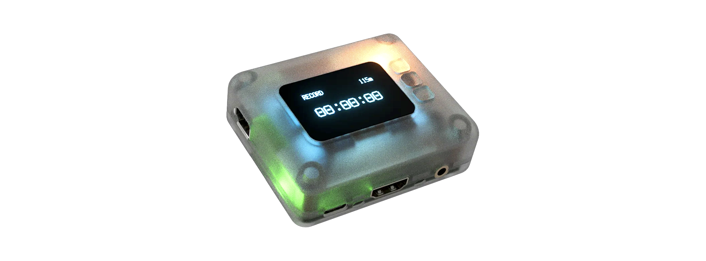

# Equip-1 ◯ DV RECORDER



Equip-1 is an open-source, portable DV recorder for camcorders with FireWire/i.LINK/DV output. It is built around a Radxa ROCK 2F and a custom PCIe FireWire HAT, so you can mount it near a camera, power it from USB-C, press one button, and record tape footage directly to removable storage.

The project is for camera enthusiasts, videographers, film schools, archivists, and hardware/software contributors who want a modern, repairable path for capturing DV tapes without keeping an old laptop alive.

The [Firehat](https://github.com/computerequipmentgroup/firehat) is also available standalone. It works as a HAT for the ROCK 2F, Raspberry Pi 5 and other SBCs.

Website: <https://www.equip-1.c-e.group/>

## Hardware

**Equip-1**

- Radxa ROCK 2F (Rockchip RK3528A, quad-core ARM Cortex-A53, 2 GB RAM, 8 GB eMMC)
- Firehat (see below)
- MicroSD storage
- USB-C power input, 5V
- HDMI output
- WiFi 6, Bluetooth 5.4
- 2x USB 2.0 Type-A
- 60 mm x 70 mm x 25 mm, ~100 g

**Firehat**

- VIA VT6315N FireWire controller
- 6-pin FireWire port (DVin)
- PCIe 2.0 x1 via FPC connector
- 40-pin 2.54 mm GPIO header (Raspberry Pi-compatible)
- OLED display
- 3x SMD buttons, RGB LED, buzzer
- 56 mm x 70 mm x 12 mm, ~25 g

## Open Source

Hardware is licensed under [CERN OHL-S](https://ohwr.org/cern_ohl_s_v2.txt). Software is licensed under GPL. Derivatives must be released under the same licenses.

## Community

Discord: [discord.gg/wpXmcb5mvK](https://discord.gg/wpXmcb5mvK)

If you like this project and want to know more about the development and future steps, or even build your own version, feel free to join this discord. We are a small community building objects with computers!

## Structure

This is an open-source hardware product repository. Editable product sources, generated manufacturing files, software, and media assets are kept separate:

- `hardware/` — electronics, mechanical design, manufacturing exports, and validation notes.
- `software/` — recorder daemon, OLED/web UIs, Buildroot image tooling, and development service templates.
- `media/` — renders, photos, product images, diagrams, screenshots, and logos.
- `releases/` — frozen release/manufacturing bundles and image checksums.

Key software paths:

- `software/equip1d/` — FastAPI recorder daemon. Owns camera detection, `dvgrab`, deck control, capture storage, preview streaming, and recorder state.
- `software/uis/oled/` — 128×64 OLED/buttons frontend for on-device control.
- `software/uis/web/` — Nuxt static web dashboard for phone/laptop control over the local Equip-1 Wi-Fi AP.
- `software/buildroot/` — appliance image, kernel/boot fragments, rootfs overlay, init scripts, and flash/build tooling.

## Development

Install Python dependencies:

```bash
python -m venv .venv
. .venv/bin/activate
pip install -r software/requirements.txt
```

Run the daemon locally:

```bash
PYTHONPATH=software python -m equip1d.main
```

Design OLED screens in a browser without hardware:

```bash
PYTHONPATH=software python -m uis.oled.designer
```

Open <http://127.0.0.1:8765>. The designer renders the real `software/uis/oled/screens.py` drawing code to a 128×64 PNG, with screen/scenario selectors, button simulation, and editable state JSON.

Build the web dashboard:

```bash
cd software/uis/web
npm install
npm run generate
```

The daemon serves `software/uis/web/.output/public` when it exists.

## Image

Equip-1 is Buildroot-first. The Buildroot overlay stages runtime files into `/opt/equip1` and BusyBox init starts the recorder daemon, OLED UI, Wi-Fi access point, storage handling, and HDMI preview.

Build and flash:

```bash
./software/buildroot/scripts/build.sh
./software/buildroot/scripts/flash.sh
```

Default device access:

- SSID: `Equip-1`
- Password: `firesecret`
- Device URL: `http://10.42.0.1:8000`
- Settings file: `/etc/equip1/equip-1.ini`

Override device settings in `software/buildroot/overlay/etc/equip1/equip-1.ini` before building.

These instructions are for development on an already-running Debian/Radxa OS.

```bash
sudo mkdir -p /opt/equip1/scripts
sudo install -m 0755 software/scripts/equip1-ap-nm.sh /opt/equip1/scripts/equip1-ap-nm.sh
sudo install -m 0755 software/scripts/equip1-hdmi-preview-fb.sh /opt/equip1/scripts/equip1-hdmi-preview-fb.sh
sudo install -m 0644 software/systemd/equip1-ap.service /etc/systemd/system/equip1-ap.service
sudo install -m 0644 software/systemd/equip1d.service /etc/systemd/system/equip1d.service
sudo install -m 0644 software/systemd/equip1-oled.service /etc/systemd/system/equip1-oled.service
sudo install -m 0644 software/systemd/equip1-hdmi-preview.service /etc/systemd/system/equip1-hdmi-preview.service
sudo systemctl daemon-reload
sudo systemctl enable --now equip1-ap.service equip1d.service equip1-oled.service equip1-hdmi-preview.service
```

## API

- `GET /api/state`
- `GET /api/storage`
- `GET /api/system`
- `GET /api/captures`
- `GET /api/captures/{capture_name}/download`
- `POST /api/time`
- `POST /api/commands/start-recording`
- `POST /api/commands/stop-recording`
- `POST /api/commands/rescan-camera`
- `POST /api/commands/clear-error`
- `WS /api/events`
